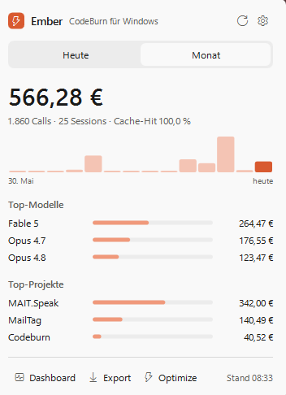

# Ember — CodeBurn for Windows

🇬🇧 English · [🇩🇪 Deutsche Version weiter unten](#ember--codeburn-für-windows)

Ember brings [CodeBurn](https://github.com/getagentseal/codeburn)'s AI coding cost
overview to the Windows 11 system tray — the Windows counterpart to CodeBurn's macOS
menubar app. A small tray icon shows today's AI coding spend; one click opens a flyout
with daily/monthly breakdowns, top models, top projects, a cost history chart, and
CodeBurn's built-in waste analysis.



## Install

One line in PowerShell:

```powershell
irm https://raw.githubusercontent.com/MAITMarcoplatzer/Ember/main/install.ps1 | iex
```

The script

1. installs the `codeburn` CLI via npm if it's missing (requires Node.js 20+),
2. downloads the latest `Ember.exe` release to `%LOCALAPPDATA%\Ember`,
3. creates a Start Menu shortcut and enables autostart,
4. launches the app — the cost icon appears in the tray.

To uninstall, run `uninstall.ps1` from this repo.

> **Note for managed corporate devices:** If a Defender ASR policy ("Block executable
> files unless they meet a prevalence, age, or trusted list criterion") blocks unsigned
> executables, run Ember through the signed .NET host instead: build with `build.ps1`
> and start `dotnet Ember.dll`. For a proper rollout, have your IT sign the exe or
> distribute it via Intune.

## Usage

| Action | Result |
|---|---|
| Left-click the tray icon | Flyout: today/month, hourly/daily bar chart, top models & projects |
| Right-click | Menu: refresh, open dashboard, autostart, quit |
| Optimize button | CodeBurn's waste analysis: health score, top findings, copy-paste fixes |
| Export button | CSV/JSON export of the current period (for Excel etc.) |
| Gear icon | Settings: currency, refresh interval, icon style, autostart |

Data refreshes every 30 seconds (configurable). Currency and amounts come straight
from CodeBurn — `codeburn currency EUR` switches the display.

## How it works

- **.NET 8 / WPF**, single-file exe, no further runtime dependencies
- Data comes exclusively from the CodeBurn CLI (`codeburn today|month --format json`,
  `codeburn export`) — no own pricing logic, no cloud, no telemetry; everything stays local
- The tray icon is rendered at runtime with the current daily amount (GDI+)
- Hourly bars are derived from the 30-second polling deltas (the CLI only provides
  daily granularity) and persisted in `%APPDATA%\Ember\hourly.json`
- The flyout follows the Windows theme (light/dark) and uses Win11 rounded corners

```
src/Ember/
  App.xaml(.cs)          entry point, tray icon, context menu, refresh loop
  FlyoutWindow.xaml(.cs) flyout UI (today/month, charts, optimize, settings)
  CodeburnClient.cs      CLI invocation + JSON parsing
  OptimizeReport.cs      parser for the optimize text report
  HourlyTracker.cs       hourly cost derivation
  TrayIconFactory.cs     dynamic cost icon
  MoneyFormat.cs         currency formatting
  Theme.cs               light/dark detection
  Autostart.cs           run-key management
```

## Development

```powershell
winget install Microsoft.DotNet.SDK.8
.\build.ps1          # produces dist\Ember.exe
```

Publishing a release: create a tag, run `build.ps1`, attach `dist\Ember.exe` as a
release asset — `install.ps1` always pulls the latest release.

## Roadmap

- [ ] Budget + end-of-month forecast in the flyout
- [ ] 7-day period (once queryable via the CLI)
- [ ] Settings dialog polish, winget package
- [ ] Possible upstream contribution to CodeBurn as `windows/`

---

# Ember — CodeBurn für Windows

🇩🇪 Deutsch · [🇬🇧 English version above](#ember--codeburn-for-windows)

Ember bringt die [CodeBurn](https://github.com/getagentseal/codeburn)-Kostenübersicht
in den Windows-11-System-Tray — das Windows-Pendant zur macOS-Menubar-App. Ein kleines
Tray-Icon zeigt die heutigen AI-Coding-Kosten; ein Klick öffnet ein Flyout mit Tages-
und Monatsübersicht, Top-Modellen, Top-Projekten, Kostenverlauf und der eingebauten
Optimize-Analyse.

## Installation

Eine Zeile in PowerShell:

```powershell
irm https://raw.githubusercontent.com/MAITMarcoplatzer/Ember/main/install.ps1 | iex
```

MAIT-intern alternativ:

```powershell
irm https://git.mait.de/AI.Network/Ember/raw/branch/main/install.ps1 | iex
```

Das Skript installiert bei Bedarf die `codeburn`-CLI per npm (Node.js 20+
vorausgesetzt), lädt die aktuelle `Ember.exe` aus dem neuesten Release nach
`%LOCALAPPDATA%\Ember`, legt Startmenü-Verknüpfung und Autostart an und startet die
App. Deinstallation: `uninstall.ps1` ausführen.

> **Hinweis für verwaltete Firmengeräte:** Blockiert eine Defender-ASR-Richtlinie
> unsignierte Exe-Dateien, läuft Ember über den signierten .NET-Host: mit `build.ps1`
> bauen und `dotnet Ember.dll` starten. Für den Rollout die Exe von der IT signieren
> oder per Intune verteilen lassen.

## Bedienung

| Aktion | Ergebnis |
|---|---|
| Linksklick auf das Tray-Icon | Flyout: Heute/Monat, Stunden-/Tagesbalken, Top-Modelle & -Projekte |
| Rechtsklick | Menü: Aktualisieren, Dashboard öffnen, Autostart, Beenden |
| Optimize | Health-Score, Top-Befunde und Fixes zum Kopieren aus `codeburn optimize` |
| Export | CSV/JSON des aktuellen Zeitraums (für Excel & Co.) |
| Zahnrad | Einstellungen: Währung, Intervall, Icon-Stil, Autostart |

Die Daten aktualisieren sich alle 30 Sekunden (einstellbar). Währung und Beträge
kommen direkt aus CodeBurn — `codeburn currency EUR` stellt auf Euro um.

## Architektur

- **.NET 8 / WPF**, Single-File-Exe, keine weiteren Laufzeitabhängigkeiten
- Datenbezug ausschließlich über die CodeBurn-CLI — keine eigene Preislogik,
  keine Cloud, keine Telemetrie; alles bleibt lokal
- Tray-Icon wird zur Laufzeit mit dem Tagesbetrag gerendert (GDI+)
- Stundenbalken werden aus den 30-Sekunden-Polling-Deltas abgeleitet
  (die CLI liefert nur Tagesgranularität), persistiert in `%APPDATA%\Ember\hourly.json`
- Flyout folgt dem Windows-Theme (hell/dunkel), abgerundete Win11-Ecken

## Entwicklung

```powershell
winget install Microsoft.DotNet.SDK.8
.\build.ps1          # erzeugt dist\Ember.exe
```

Release veröffentlichen: Tag erstellen, `build.ps1` ausführen, `dist\Ember.exe` als
Release-Asset anhängen — `install.ps1` probiert erst MAIT-Gitea, dann GitHub.

Das Projekt wird parallel gepflegt auf
[github.com/MAITMarcoplatzer/Ember](https://github.com/MAITMarcoplatzer/Ember) (öffentlich)
und [git.mait.de/AI.Network/Ember](https://git.mait.de/AI.Network/Ember) (MAIT-intern).
